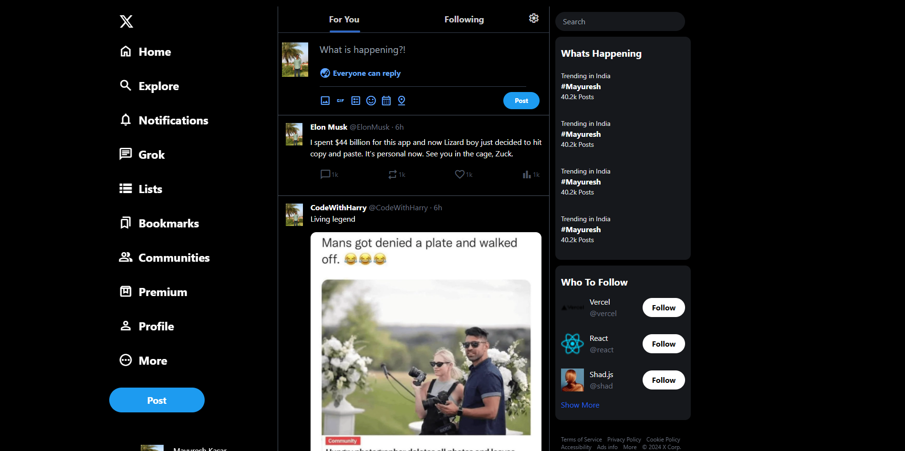

# 🐦 X Clone – Responsive Social Media UI Project



## 📌 Project Overview

**X Clone** is a fully responsive social media user interface inspired by the modern X (Twitter) platform.

This project focuses on building a clean, responsive, and interactive frontend layout using **HTML** and **Tailwind CSS**. It replicates key UI components such as navigation sidebar, post feed, user profile section, and responsive design behavior.

The primary goal of this project was to strengthen frontend development skills and understand real-world social media UI architecture.

> ⚠ This project is for educational and portfolio purposes only and is not affiliated with X (Twitter).

---

## 🚀 Live Demo

🔗 https://mayuresh-2601.github.io/X-Clone/

---

## 🎯 Key Features

✔ Responsive Sidebar Navigation
✔ Social Media Feed Layout
✔ User Profile Section
✔ Post Input Interface
✔ Sticky Navigation Bar
✔ Hover Effects & UI Animations
✔ Mobile Responsive Design
✔ Modern Dark Theme UI
✔ Tailwind CSS Utility Styling
✔ Clean and Structured Layout

---

## 🛠️ Technologies Used

* HTML5 (Semantic structure)
* Tailwind CSS (Utility-first styling)
* Flexbox & Responsive Layout
* CSS3 (Styling and layout)
* Git & GitHub (Version control)
* GitHub Pages (Deployment)

---

## 📂 Project Structure

X-Clone/
│
├── index.html
├── css/
│   ├── input.css
│   └── output.css
├── tailwind.config.js
├── package.json
├── package-lock.json
├── .gitignore
└── README.md

---

## ⚙️ Tailwind CSS Setup

This project uses Tailwind CSS to generate styles automatically.

Run the following command to build Tailwind CSS:

```bash
npm run build
```

This will generate the compiled CSS file:

```text
css/output.css
```

---

## 📱 Responsive Design

This project is fully responsive and optimized for:

* Desktop screens
* Tablet devices
* Mobile devices
* Different screen sizes

The layout automatically adapts using Tailwind CSS responsive utilities.

---

## 🎨 UI Components Implemented

### Sidebar Navigation

* Home
* Explore
* Notifications
* Messages
* Bookmarks
* Communities
* Profile

### Feed Section

* Post display layout
* User avatar and username
* Post content area
* Interaction icons

### Post Input Area

* Text input field
* Media icons
* Post button
* Reply visibility indicator

---

## 📈 What I Learned

* Building real-world UI layouts
* Using Tailwind CSS effectively
* Responsive design principles
* Flexbox layout techniques
* Component-based UI structure
* Git and GitHub workflow
* Project deployment using GitHub Pages
* Clean project organization

---

## 🚀 How to Run This Project Locally

1. Clone this repository:

```bash
git clone https://github.com/mayuresh-2601/X-Clone.git
```

2. Navigate into the project folder:

```bash
cd X-Clone
```

3. Install dependencies:

```bash
npm install
```

4. Run Tailwind build:

```bash
npm run build
```

5. Open:

```text
index.html
```

---

## 🌐 Deployment

This project is deployed using:

GitHub Pages

Live URL:

https://mayuresh-2601.github.io/X-Clone/

---

## 👨‍💻 Author

**Mayuresh Kasar**
Frontend Developer | Full Stack Developer | Web Development Enthusiast

GitHub:
https://github.com/mayuresh-2601

---

## ⭐ Support

If you like this project, consider giving it a ⭐ on GitHub!
